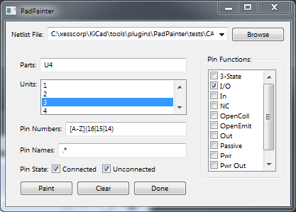
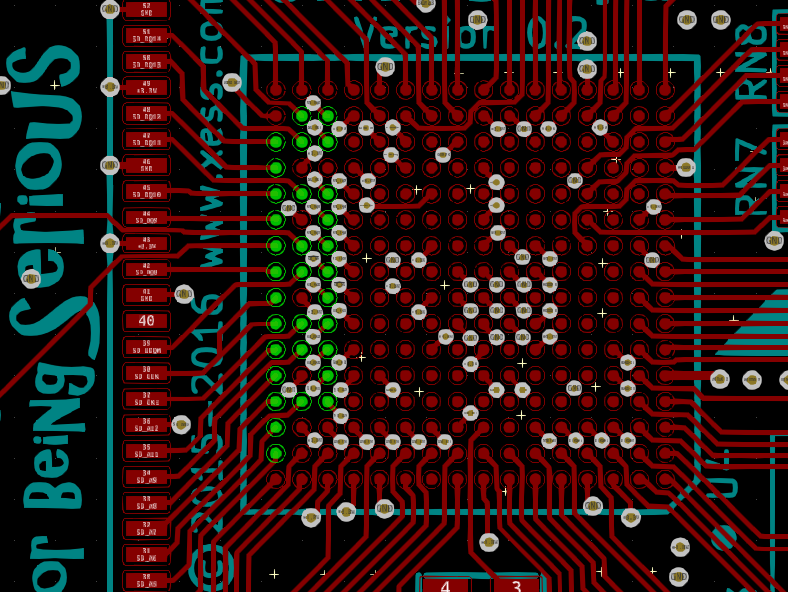

# PadPainter Plugin

This PCBNEW plugin identifies pins that meet specified criteria and highlights
the associated pads on the PCB.
This is helpful for identifying sets of related pins when physically planning
the layout of high pin-count packages such as FPGAs.

* Free software: MIT license

## Features

* Highlights selected pads in one or more footprints of a PCB.
* Footprints are selected using their part reference.
* Pads within a footprint are filtered by their numbers, names, pin function (e.g., input, output, bidirectional),
  and unit (for multi-unit parts such as I/O banks in an FPGA).

## Installation

Just copy `PadPainter.py` to the `kicad/share/kicad/scripting/plugins` directory.

## Usage

The plugin is started by pressing the `Tools => External Plugins... => PadPainter` button.
This brings up the following window:

### Netlist File Field

The `Netlist File` field is used to specify the netlist associated with the PCB.
This is used to determine the pin names and electrical properties of the pads
in the PCB footprints.

Upon startup, PadPainter will populate this field with a file name based on 
the PCB file name with a `.net` extension. You are free to change this by 
typing a new name, selecting a new file using the file browser, or by 
dragging a new netlist file into the field.
 
### Parts Field

The parts whose pads will be highlighted are specified as a comma-separated list
of part reference IDs in the `Parts` field.
If one or more parts are selected before starting PadPainter, then this field
will be pre-populated with their reference IDs.
Otherwise, you'll just type-in the IDs for the parts you want to highlight.

After entering the part IDs, make sure to press the ENTER key.
This signals PadPainter that it should look-up the information on the given 
parts.

### Units Field

This field lists the names of the units found in the parts specified in the 
`Parts` field. (Most high pin-count parts are broken up into multiple units, 
each of which provides some specific function.) Selecting one or more of 
the units in this field will restrict the highlighting of pads to those 
specific units. (Use shift-click to select a range of units, or ctrl-click 
to select multiple, non-contiguous list entries.)
 
### Pin Numbers

This field stores a
[*Python regular expression*](https://www.datacamp.com/community/tutorials/python-regular-expression-tutorial)
(REGEX) that is used to select pins with matching numbers from the parts.
Upon start up, this field is pre-populated with a regular expression that 
matches everything (`.*`).

One use of this field might be to highlight a specific row of a BGA using a REGEX
like `^A[0-9]+$` which would select all pin numbers starting with a single 
`A` that is then followed by one or more digits (e.g., `A1` or `A18`).
 
### Pin Names

This field stores a REGEX
that is used to select pins with matching names from the parts.
Upon start up, this field is pre-populated with a regular expression that 
matches everything (`.*`).

One use of this field might be to highlight specific pins using a REGEX
like `MGT` which would select all pins with names containing the string
`MGT` (for *multigigabit transceiver*).

### Pin Functions:

These checkboxes are used to select the electrical types of the pins that 
will be highlighted. (For instance, you can restrict PadPainter so it only 
highlights bidirectional pins.)
 
`All` and `None` checkboxes are also provided to quickly enable or disable 
all the pin function filters.

### Pin State

These checkboxes are used to select pins which are connected or unconnected to nets.
For example, checking the `Unconnected` box will only highlight pins that are
not currently connected to anything.

### Action Buttons

Upon pressing the `Paint` or `Clear` button, PadPainter will extract all the pads
on the given parts which:

* Are members of the selected part units.
* Have pin numbers that match with the REGEX in the `Pin Numbers` field.
* Have pin names that match with the REGEX in the `Pin Names` field.
* Have electrical functions that match one of the checked types in the `Pin Functions` checkboxes.
* Are connected or unconnected to nets as indicated by the `Pin State` checkboxes.
 
Then PadPainter will either add or clear the highlighting to the extracted pads.

Pressing the `Done` button will terminate PadPainter. This will 
not return any highlighted pads to their original state; they will remain 
highlighted. This is essential behavior for marking pins and then doing 
placement and routing based on the displayed information. It also allows you 
to highlight parts and then come back later and highlight further parts 
without losing your previous work.
 
### Example

Here is an example of highlighting only the **three outermost columns** of 
**I/O** pins in **bank 3** of an FPGA (**U4**):

Pressing `Paint` results in highlighting these pads:

## Credits

### Development Lead

* XESS Corp. <info@xess.com>

### Contributors

Hildo Guillardi Júnior - https://github.com/hildogjr

## History

### 0.2.0 (2018-07-22)

* Modified GUI.

### 0.1.0 (2018-05-28)

* First release.
